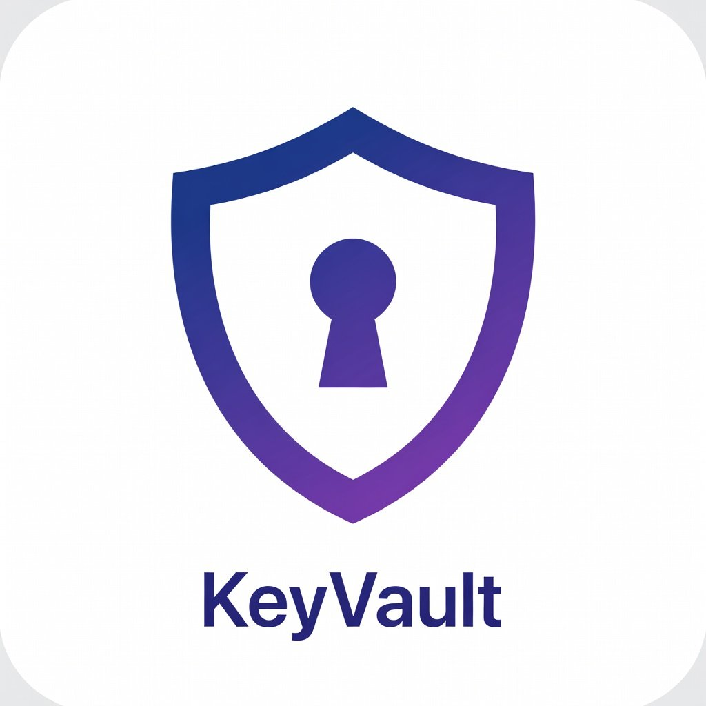
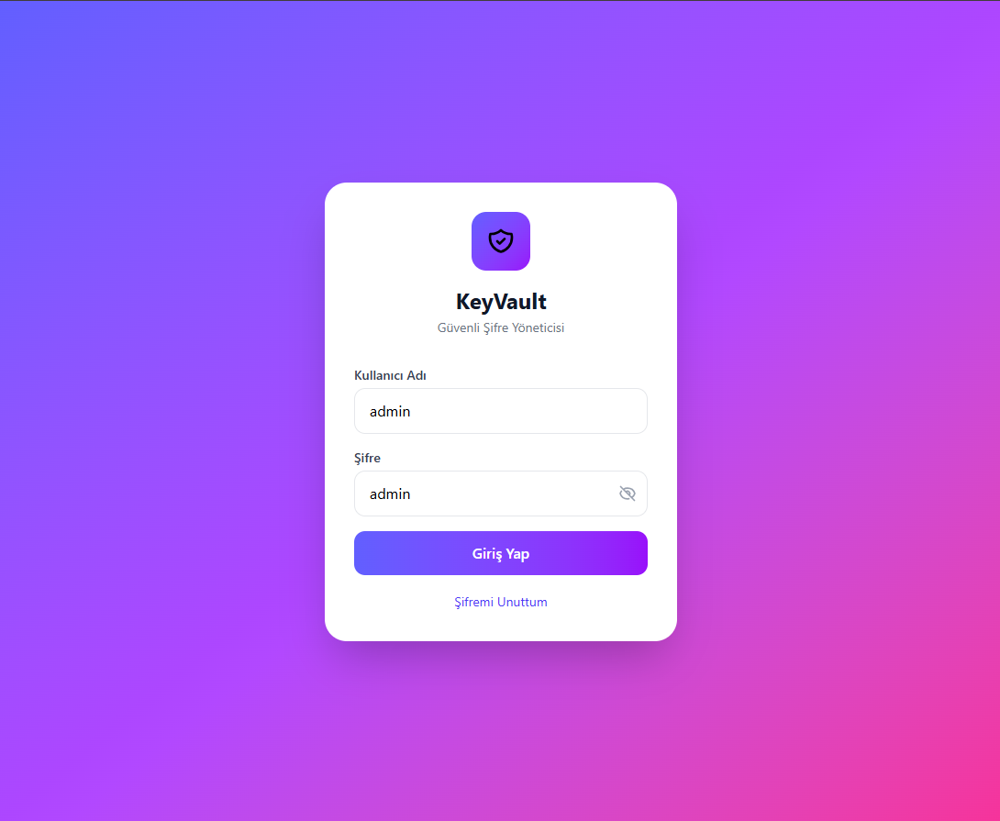
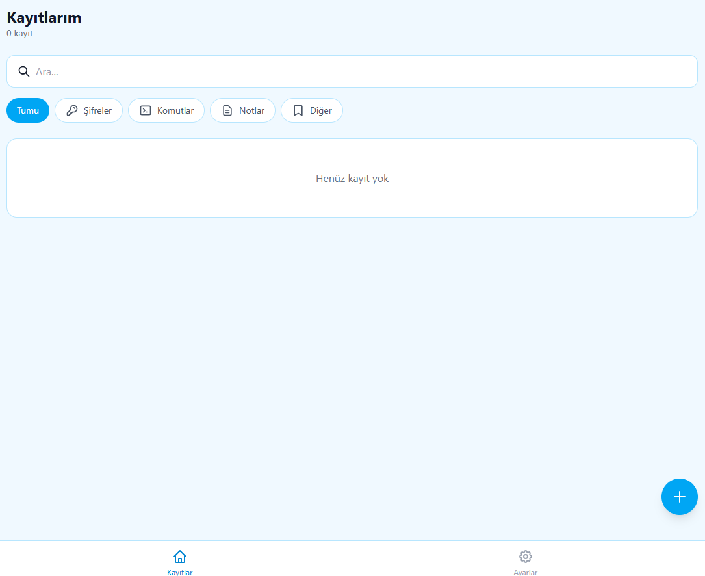
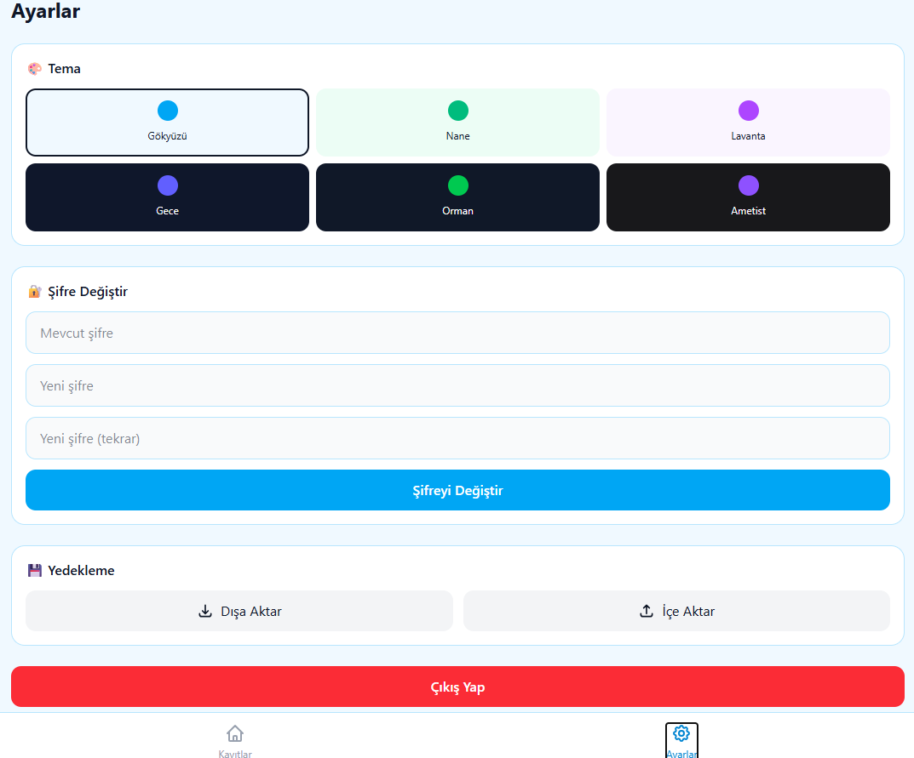

# 🔐 KeyVault - Şifre ve Not Yöneticisi

<p align="center">
  
</p>

<p align="center">
  <strong>Güvenli, hızlı ve kullanımı kolay şifre & not yönetim uygulaması</strong>
</p>

<p align="center">
  <a href="#özellikler">Özellikler</a> •
  <a href="#kurulum">Kurulum</a> •
  <a href="#kullanım">Kullanım</a> •
  <a href="#pwa-kurulumu">PWA Kurulumu</a> •
  <a href="#destek">Destek</a> •
  <a href="#lisans">Lisans</a>
</p>

<p align="center">
  
  
  
  
  
</p>

---

## 📸 Ekran Görüntüleri

| Giriş | Kayıtlar | Ayarlar |
|:-----:|:--------:|:-------:|
|  |  |  |

---

## ✨ Özellikler

### 🔒 Güvenlik
- **Şifreli Giriş** - Varsayılan: `admin / admin`
- **Şifre Değiştirme** - Ayarlardan kolayca değiştirin
- **Recovery Kodları** - Şifrenizi unutursanız sıfırlama imkanı
- **LocalStorage** - Verileriniz cihazınızda güvenle saklanır

### 📝 Kayıt Yönetimi
- **4 Kategori:** Şifre 🔑 | Komut 💻 | Not 📝 | Diğer 📌
- **Detaylı Kayıtlar:** Başlık, kullanıcı adı, şifre, URL, notlar
- **Tek Tıkla Kopyalama** - Şifre ve bilgileri anında kopyalayın
- **Şifre Göster/Gizle** - Gizlilik için toggle
- **Arama & Filtreleme** - Kayıtlar arasında hızlı arama

### 🎨 Temalar
| Açık Temalar | Koyu Temalar |
|:------------:|:------------:|
| ☀️ Gökyüzü (Mavi) | 🌙 Gece (Lacivert) |
| 🌿 Nane (Yeşil) | 🌲 Orman (Koyu Yeşil) |
| 💜 Lavanta (Mor) | 🔮 Ametist (Koyu Mor) |

### 💾 Veri Yönetimi
- **Dışa Aktar** - JSON formatında yedekleme
- **İçe Aktar** - Yedekten geri yükleme
- **Offline Çalışma** - İnternet olmadan da kullanın

### 📱 PWA Desteği
- Android ve iOS'a **programsız kurulum**
- Ana ekranda uygulama ikonu
- Tam ekran deneyimi
- Splash screen

---

## 🚀 Kurulum

### Gereksinimler
- Node.js 18+ 
- npm veya yarn

### Adımlar

```bash
# 1. Repo'yu klonlayın
git clone https://github.com/bilalsafercan/keyvault.git

# 2. Klasöre girin
cd keyvault

# 3. Bağımlılıkları yükleyin
npm install

# 4. Geliştirme sunucusunu başlatın
npm run dev

# 5. Tarayıcıda açın
# http://localhost:5173
```

### Production Build

```bash
# Build oluşturun
npm run build

# Preview yapın
npm run preview
```

---

## 📖 Kullanım

### İlk Giriş
- **Kullanıcı Adı:** `admin`
- **Şifre:** `admin`

> ⚠️ İlk girişten sonra şifrenizi değiştirmenizi öneririz!

### Yeni Kayıt Ekleme
1. Ana sayfada **"+ Yeni Kayıt"** butonuna tıklayın
2. Kategori seçin (Şifre, Komut, Not, Diğer)
3. Bilgileri doldurun
4. **"Kaydet"** butonuna tıklayın

### Şifre Değiştirme
1. **Ayarlar** sekmesine gidin
2. Mevcut şifrenizi girin
3. Yeni şifrenizi iki kez girin
4. **"Şifreyi Değiştir"** butonuna tıklayın

---

## 📱 PWA Kurulumu

### Android (Chrome)
1. Siteyi Chrome'da açın
2. **⋮** menüsüne tıklayın
3. **"Ana ekrana ekle"** seçin
4. **"Yükle"** onaylayın

### iPhone (Safari)
1. Siteyi Safari'de açın
2. **↑** (Paylaş) butonuna tıklayın
3. **"Ana Ekrana Ekle"** seçin
4. **"Ekle"** onaylayın

---

## 🆘 Destek

### Şifremi Unuttum!
Şifrenizi unuttuysanız, recovery kodu ile sıfırlayabilirsiniz:

1. Giriş ekranında **"Şifremi Unuttum"** linkine tıklayın
2. Size verilen **Recovery Kodu** girin
3. Şifreniz `admin` olarak sıfırlanır

> 📧 Recovery kodunuz yoksa: **bilalsafercan@gmail.com** adresine mail atın.
> 📧 Recovery kodunuz yoksa: **+90-539-741-0789** numarasına mesaj atın.

### Sorun Bildirme
- [GitHub Issues](https://github.com/bilalsafercan/keyvault/issues) üzerinden bildirebilirsiniz

### Katkıda Bulunma
1. Fork yapın
2. Feature branch oluşturun (`git checkout -b feature/yenilik`)
3. Commit yapın (`git commit -m 'Yeni özellik eklendi'`)
4. Push yapın (`git push origin feature/yenilik`)
5. Pull Request açın

---

## 🛠️ Teknolojiler

| Teknoloji | Kullanım |
|-----------|----------|
| [React 18](https://react.dev/) | UI Framework |
| [TypeScript](https://www.typescriptlang.org/) | Type Safety |
| [Vite](https://vitejs.dev/) | Build Tool |
| [Tailwind CSS](https://tailwindcss.com/) | Styling |
| [Lucide Icons](https://lucide.dev/) | İkonlar |
| [PWA](https://web.dev/progressive-web-apps/) | Mobil Kurulum |

---

## 📂 Proje Yapısı

```
keyvault/
├── public/
│   ├── icons/              # PWA ikonları
│   ├── screenshots/        # Store görüntüleri
│   ├── manifest.json       # PWA manifest
│   ├── sw.js              # Service Worker
│   └── privacy-policy.html # Gizlilik politikası
├── src/
│   ├── App.tsx            # Ana uygulama
│   ├── main.tsx           # Entry point
│   └── index.css          # Global stiller
├── index.html
├── package.json
├── tailwind.config.js
├── tsconfig.json
├── vite.config.ts
├── README.md
├── LICENSE
└── PLAY_STORE_GUIDE.md
```

---

## 📄 Lisans

Bu proje **MIT Lisansı** ile lisanslanmıştır. Detaylar için [LICENSE](LICENSE) dosyasına bakın.

**Kısaca:**
- ✅ Ticari kullanım
- ✅ Değiştirme
- ✅ Dağıtma
- ✅ Özel kullanım
- ❌ Sorumluluk yok
- ❌ Garanti yok

---

## 👨‍💻 Geliştirici

<p align="center">
  Made with ❤️ by <a href="https://github.com/bilalsafercan">Bilal Safer CAN</a>
</p>

---

<p align="center">
  ⭐ Beğendiyseniz yıldız vermeyi unutmayın! ⭐
</p>
